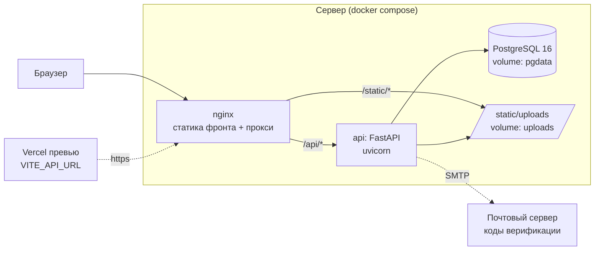
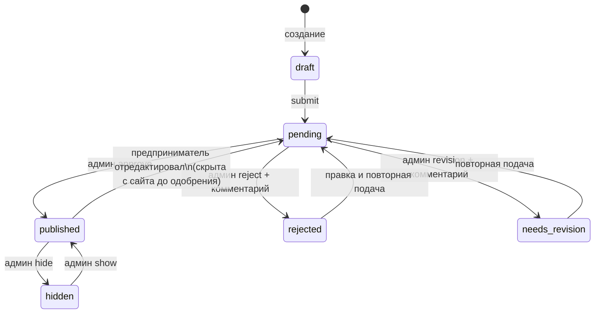
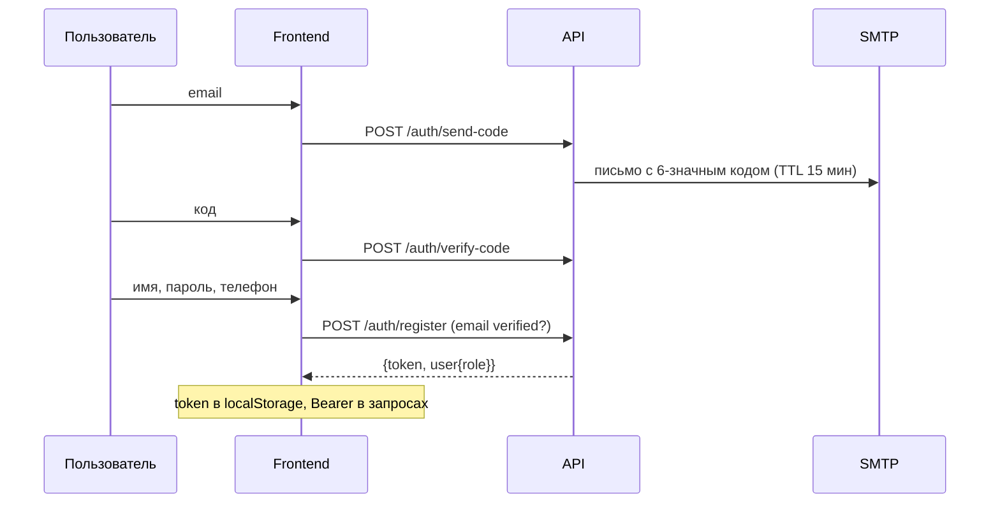

# feat: SiGup production — полный продукт по ТЗ

## Summary

Довести SiGup до production-продукта по ТЗ v1.0: настоящий **бэкенд на FastAPI + PostgreSQL** (по паттернам brunchcoffee: email-верификация кодом, соль+хеш пароля, opaque-сессии в БД, загрузки в static/), **фронтенд переводится с in-memory стора на реальный API** (регистрация/вход/восстановление, кабинет с несколькими карточками и статусами, модерация, админ-панель), **визуал доводится до 4 загруженных мокапов** (кремовая палитра, черкесский орнамент, отдельный admin-shell), и всё пакуется в **переносимый docker-compose** (postgres + api + nginx с собранным фронтом) — «закинул на любой сервер и запустил».

Решения пользователя, зафиксированные на скоуп-гейте: **Объявления не строим** (таблицу в БД не создаём; ТЗ §11 сознательно исключён); **деплой = Docker**; **верификация email-кодом** (как в brunch); **карты = OpenStreetMap + Leaflet**. Мокапы приоритетнее ТЗ по визуалу; более поздние решения пользователя приоритетнее мокапов по составу UI (поиск в шапке, публикация только из кабинета, без «Объявлений», без сердечек-избранного — вне MVP по ТЗ §14).

**Не входит (ТЗ §14 + решения):** объявления, избранное, отзывы/рейтинги, Google-auth, онлайн-оплата, бронирование, push/email-уведомления предпринимателям, подписки, аналитика для предпринимателей, SMS-верификация, кабинет обычного посетителя.

---

## Problem Frame

Сейчас SiGup — SPA с премиальным фронтом (11 экранов, дизайн-система, роутинг), но **без бэкенда**: данные в `useState` из `src/initialData.ts`, роли переключаются dev-симулятором, формы входа/регистрации — заглушки, «модерация» мутирует память, фото — внешние Unsplash-URL. По ТЗ нужен реальный продукт: предприниматели сами регистрируются, создают несколько карточек, отправляют на модерацию; админ управляет всем контентом без разработчика; гости видят только опубликованное; карточки индексируются.

Референс brunchcoffee даёт проверенный каркас (FastAPI 0.115 + SQLAlchemy 2 + Pydantic 2, `DATABASE_URL` Postgres/SQLite-fallback, `email_service.py` с рабочим SMTP, `UserCredential` hash+salt, `AuthSession` opaque-токены, rate-limit, `static/` uploads) — адаптируем, а не изобретаем. «По всем канонам» сверх brunch: Alembic-миграции, bcrypt (passlib), pytest-покрытие API, docker-compose с healthchecks.

---

## Requirements

Трассировка на ТЗ (§) и мокапы (M1 = карточка, M2 = кабинет, M3 = админка, M4 = главная).

- **R1. Роли** (§3, §16): guest / entrepreneur / admin; сервер — источник истины по роли; админ-панель закрыта от неавторизованных; dev-симулятор ролей удаляется.
- **R2. Auth** (§8.1): регистрация email+пароль с подтверждением кодом на почту; вход; выход; восстановление пароля кодом; телефон — поле профиля.
- **R3. Кабинет** (§8.2, M2): несколько карточек; создание/редактирование; загрузка/удаление фото; отправка на проверку; видимость статуса и комментария админа; настройки профиля; заполненность.
- **R4. Карточка** (§7, §17): все поля ТЗ §7.1 (в т.ч. WhatsApp/Telegram/сайт/цены-текст/доставка); статусы: черновик, на проверке, опубликована, отклонена, требует исправления, скрыта; товары внутри карточки (уже есть на фронте — сохраняем как расширение §7.2).
- **R5. Модерация** (§9): очередь; publish / reject / needs-revision с комментарием; hide; правка карточек админом; на сайте гостям — только «опубликована».
- **R6. Каталог** (§6): поиск по названию/описанию/категории/городу/стране; фильтры категория + страна/город; сортировка: новые, популярные (featured), по алфавиту; категории управляются админом.
- **R7. Страница карточки** (§7.3, M1): галерея, блок «Связаться» с каналами (только заполненные), карта OSM/Leaflet при наличии адреса, товары, похожие проекты, цены/доставка.
- **R8. Афиша** (§10, M4): карусель на главной + страница; поля §10.2; закрепление (featured); управление админом.
- **R9. Админ-панель** (§12, M3): отдельный shell (topbar + sidebar); дашборд с метриками и активностью; очередь модерации; пользователи; карточки по статусам; категории CRUD; афиша CRUD; медиафайлы — в объёме загрузок карточек/афиш.
- **R10. SEO** (§16): ЧПУ-slug карточек, per-route title/description/OG, robots.txt, sitemap.xml из БД.
- **R11. Изображения** (§16): серверная оптимизация (ресайз + thumbnail), лимиты размера/типа.
- **R12. Дизайн = мокапы** (M1–M4, §15): кремовый фон, орнамент (футер-водяной знак, кромка hero), line-art иконки категорий, layout-структуры мокапов; адаптив.
- **R13. Docker**: `docker compose up` на чистом сервере поднимает всё (pg + api + nginx + собранный фронт + volumes); конфиг через `.env`.
- **R14. Валидация и ошибки** (§16): серверная валидация (Pydantic), внятные ошибки форм на фронте, обработка 4xx/5xx.
- **R15. Тесты**: pytest на auth/карточки/модерацию/загрузки; e2e-прогон полного стека по сценариям ТЗ §18.

**Success criteria:** сценарии ТЗ §18.1–18.3 проходят на живом стеке от начала до конца (гость находит и связывается; предприниматель регистрируется → создаёт → модерация → публикация; админ управляет всем без разработчика); визуально страницы соответствуют мокапам; `docker compose up` на чистой машине даёт рабочий сайт; pytest и e2e зелёные.

---

## Key Technical Decisions

- **KTD-1. Бэкенд = адаптация brunch, не переизобретение.** FastAPI + SQLAlchemy 2 + Pydantic 2; Postgres через `DATABASE_URL` (+SQLite-fallback для локали, как в brunch `database.py`); opaque-сессии в таблице (`secrets.token_urlsafe`, Bearer-заголовок, TTL 30 дней, logout = delete) — **не JWT**: проще ревокация, паттерн уже проверен. Email-коды: 6 цифр, TTL 15 мин, по образцу `email_service.py` (SMTP-креды перенести из brunch `.env`).
- **KTD-2. «По канонам» сверх brunch:** пароли — bcrypt (passlib) вместо самодельного hash+salt; **Alembic** для миграций (create_all только в тестах); pytest + httpx TestClient; строгие Pydantic-схемы на вход/выход; статусы — Python enum ↔ Postgres enum.
- **KTD-3. Модерационная машина статусов** (единственный источник переходов — сервер): `draft → pending` (submit предпринимателем); `pending → published | rejected | needs_revision` (админ; reject/revision требуют комментария); `needs_revision → pending` (повторная подача); `published → hidden ↔ published` (админ); **редактирование опубликованной карточки предпринимателем → снова `pending` и скрытие с сайта до одобрения** (простая и честная семантика для MVP; правка админом статуса не меняет).
- **KTD-4. Фото:** multipart-upload → `static/uploads/{card_id}/`, ≤10 фото на карточку, ≤5MB, jpeg/png/webp; Pillow: ресайз до 1600px + thumb 400px, сохранение в webp. Сид-данные оставляют внешние Unsplash-URL (поле `url` поддерживает оба вида).
- **KTD-5. Публичный API отдаёт только published**; фильтры/поиск/сортировка — на сервере (ilike по name/descriptions/city/country + join категории; сортировки: `-created_at`, featured-first, name). Slug: транслит названия + `-{id}` (`/catalog/syrnaya-masterskaya-uzdyh-12`), редирект/резолв по id-суффиксу — устойчиво к переименованиям (R10).
- **KTD-6. Admin-shell отдельным layout-ом** (M3): свой topbar (логотип, колокольчик, admin-email) + sidebar (Дашборд, Пользователи, Карточки, На модерации+счётчик, Афиша, Категории, Настройки, «Перейти на сайт»), маршруты `/admin/*` под ролью admin. Публичный Header/Footer в админке не рендерятся.
- **KTD-7. Карты — Leaflet + OpenStreetMap** (решение пользователя): гео-точка карточки задаётся полями lat/lng (админ/предприниматель могут указать координаты; геокодинг Nominatim — best-effort кнопка «найти по адресу», без ключей). Карта на странице карточки при наличии координат/адреса (M1).
- **KTD-8. Docker-компоновка (решение пользователя):** `docker-compose.yml` = `postgres:16` (volume pgdata) + `api` (Dockerfile backend, volume uploads) + `nginx` (собранный фронт из multi-stage build + прокси `/api` → api, `/static` → uploads). Всё конфигурируется `.env`; healthchecks; `restart: unless-stopped`. Vercel остаётся превью-фронтом через `VITE_API_URL`.
- **KTD-9. Приоритет источников UI:** мокапы M1–M4 задают палитру/компоновку; поздние решения пользователя корректируют состав: поиск — в шапке (не в hero), «Разместить проект» — только из кабинета, раздел «Объявления» отсутствует, сердечки-избранное не рендерим (вне MVP §14), рейтинги-звёзды убираем из карточек (вне MVP §14 — сейчас фейковые значения). Существующая дизайн-система (токены/примитивы/motion) сохраняется и перекрашивается токенами, не переписывается.
- **KTD-10. Открытые вопросы ТЗ §19 — решения MVP:** карточки бесплатны; лимита карточек нет; статистика просмотров — не в MVP; языки UI ru/kbd/en остаются (контент карточек — на языке автора); ручное выделение — флаг `is_featured` у карточек и афиш (админ); правила модерации — текстовая страница позже (вне скоупа кода).

---

## High-Level Technical Design

### Архитектура и деплой



### Машина статусов карточки (KTD-3)



### Регистрация с email-кодом (паттерн brunch)



### Ядро данных

```mermaid
erDiagram
    users ||--o{ user_credentials : has
    users ||--o{ auth_sessions : has
    users ||--o{ cards : owns
    categories ||--o{ cards : classifies
    cards ||--o{ card_photos : has
    cards ||--o{ card_products : has
    cards ||--o{ moderation_events : history
    users { int id PK; string name; string email; string phone; string role; string city; string country; datetime created_at }
    cards { int id PK; string slug; string name; int category_id FK; string short_description; text full_description; string country; string city; string address; float lat; float lng; string instagram; string phone; string whatsapp; string telegram; string website; string price_info; string delivery_info; enum status; text admin_comment; bool is_featured; int owner_id FK; datetime created_at; datetime updated_at }
    events { int id PK; string title; enum type; string image_url; date date_start; date date_end; string location; text description; string link; enum status; bool is_featured }
    moderation_events { int id PK; int card_id FK; int admin_id FK; string action; text comment; datetime created_at }
```

*(email_verifications, password_resets — по образцу brunch; card_products — существующие «товары внутри карточки».)*

---

## Output Structure

```
backend/
  app/
    main.py            # FastAPI, CORS, rate-limit, static mount, роутеры
    config.py          # env-настройки (pydantic-settings)
    database.py        # engine Postgres/SQLite-fallback (паттерн brunch)
    models.py          # SQLAlchemy-модели (ER выше)
    schemas.py         # Pydantic-схемы
    auth.py            # хеширование (bcrypt), сессии, зависимости current_user/require_admin
    email_service.py   # адаптация brunch (коды верификации/сброса)
    routers/
      auth.py          # send-code, verify-code, register, login, logout, me, password-reset
      catalog.py       # публичные: cards list/detail/similar, categories, events, sitemap
      cabinet.py       # мои карточки CRUD, submit, фото upload/delete, профиль
      admin.py         # очередь, approve/reject/revision/hide, users, categories, events, stats
    services/
      images.py        # Pillow: валидация, ресайз, thumb, webp
      slugs.py         # транслит-slug + id-суффикс
    seed.py            # категории ТЗ + перенос src/initialData.ts + админ из env
  alembic/             # миграции
  tests/               # pytest: test_auth.py, test_cards.py, test_moderation.py, test_uploads.py
  requirements.txt
  Dockerfile
  .env.example
deploy/
  docker-compose.yml   # postgres + api + nginx
  nginx.conf
  DEPLOY.md            # «закинуть на сервер и запустить»
frontend (существующий src/):
  src/lib/api.ts       # HTTP-клиент + токен
  src/lib/auth.tsx     # AuthProvider (реальный)
  src/components/admin/AdminLayout.tsx  # shell M3
  src/assets/ornament.svg               # орнамент (футер/hero)
  Dockerfile.frontend  # multi-stage: build → nginx
```

---

## Implementation Units

### Фаза 1 — Бэкенд

### U1. Каркас бэкенда

**Goal.** Запускаемое FastAPI-приложение с конфигом, БД-подключением, CORS, rate-limit, static, health.
**Requirements.** R1 (фундамент), R13, R14.
**Dependencies.** —
**Files.** `backend/app/{main,config,database}.py`, `backend/requirements.txt`, `backend/.env.example`, `backend/alembic/` (init), `backend/tests/conftest.py`.
**Approach.** `database.py` — прямая адаптация brunch (Postgres по `DATABASE_URL`, SQLite-fallback). `config.py` на pydantic-settings: DATABASE_URL, SMTP_*, ADMIN_EMAIL/PASSWORD, UPLOAD_DIR, CORS_ORIGINS, SESSION_TTL. Rate-limit middleware из brunch main.py. `/api/health` для healthcheck. conftest: тестовая SQLite + TestClient.
**Patterns to follow.** `brunchcoffee/backend/{database,main}.py`.
**Test scenarios.**
- Happy: `GET /api/health` → 200 `{status:"ok", db:"connected"}`.
- Edge: без DATABASE_URL — стартует на SQLite (лог-предупреждение).
- Error: >120 запросов/мин с одного IP → 429.

### U2. Модели, миграции, сид

**Goal.** Полная схема данных + первая Alembic-миграция + сид (категории ТЗ, перенос initialData, админ).
**Requirements.** R4, R6, R8, R1.
**Dependencies.** U1.
**Files.** `backend/app/models.py`, `backend/alembic/versions/0001_*.py`, `backend/app/seed.py`, `backend/tests/test_models.py`.
**Approach.** Таблицы по ER-диаграмме; статусы карточки/афиши — Postgres enum (значения KTD-3 + афиша: draft/published/hidden/finished из §10.2). Сид идемпотентен (upsert по slug/email): 10 категорий ТЗ §6.1, карточки/афиши из `src/initialData.ts` (владелец — сид-предприниматель, статусы как в данных), админ из env. `moderation_events` пишется при каждом действии админа (история для «Недавняя активность» M3).
**Test scenarios.**
- Happy: миграция на чистую БД проходит; повторный сид не дублирует.
- Edge: карточка без опциональных полей (whatsapp/website/lat) валидна.
- Covers §17: enum отклоняет неизвестный статус.

### U3. Auth API

**Goal.** Регистрация с email-кодом, вход, выход, me, восстановление пароля; роли.
**Requirements.** R2, R1, R14.
**Dependencies.** U2.
**Files.** `backend/app/{auth.py,email_service.py}`, `backend/app/routers/auth.py`, `backend/tests/test_auth.py`.
**Approach.** По brunch: `send-code`/`verify-code` (+ то же для reset), register требует verified email; bcrypt; opaque-токен в `auth_sessions` (TTL 30 дней; протухшие чистятся лениво). Depends: `get_current_user` (Bearer), `require_admin`. Email-нормализация lower/trim. SMTP-креды — перенести из brunch `.env` (пользователь подтвердил, что там рабочие).
**Execution note.** Test-first на матрицу auth-ошибок.
**Test scenarios.**
- Covers §18.2: register(verified) → login → `GET /me` → role=entrepreneur.
- Error: register без verify → 403; дубль email → 409; неверный пароль → 401; протухший/битый токен → 401; неверный код → 400; код повторно → 400.
- Happy: password-reset: send-code → verify → новый пароль → старый токен инвалидирован, вход по новому работает.
- Edge: email в разном регистре — один аккаунт.

### U4. Загрузка фото

**Goal.** Multipart-загрузка с валидацией и оптимизацией (Pillow), удаление.
**Requirements.** R11, R3, R14.
**Dependencies.** U2, U3.
**Files.** `backend/app/services/images.py`, эндпоинты в `backend/app/routers/cabinet.py`, `backend/tests/test_uploads.py`.
**Approach.** `POST /cabinet/cards/{id}/photos` (владелец или админ): проверка mime+магических байтов, ≤5MB, ≤10 фото; Pillow → webp 1600px + thumb 400px; `card_photos(url, thumb_url, sort_order)`. `DELETE` удаляет запись+файлы. Раздача — StaticFiles/`/static` (в проде nginx).
**Test scenarios.**
- Happy: jpeg 3MB → 201, файлы на диске, url в ответе.
- Error: pdf → 415; 6MB → 413; 11-е фото → 409; чужая карточка → 403.
- Integration: удаление карточки удаляет её файлы.

### U5. API каталога и кабинета (карточки)

**Goal.** Публичный каталог (только published; фильтры/поиск/сортировка/slug/similar) и CRUD карточек кабинета со статусной машиной.
**Requirements.** R4, R5 (переходы entrepreneur-стороны), R6, R7, R10 (slug).
**Dependencies.** U2, U3, U4.
**Files.** `backend/app/routers/{catalog,cabinet}.py`, `backend/app/services/slugs.py`, `backend/tests/test_cards.py`.
**Approach.** Публичное: `GET /catalog/cards?q&category&country&city&sort&page` (ilike-поиск §6.2; сортировки KTD-5; пагинация limit/offset + total), `GET /catalog/cards/{slug}` (резолв по id-суффиксу), `similar` (та же категория, published, ≠self), `GET /categories` (с count published). Кабинет: `GET /cabinet/cards?status`, `POST` (draft), `PATCH` (правка; **если карточка была published → status=pending**, KTD-3), `POST .../submit` (draft|needs_revision|rejected → pending), `DELETE`. `card_products` — вложенный массив в PATCH.
**Test scenarios.**
- Covers §18.1: гость видит только published; draft/pending/hidden в списке и по slug → 404.
- Happy: фильтр category+city сужает; q находит по описанию; sort=name — алфавит; sort=featured — featured первыми.
- Covers KTD-3: PATCH published-карточки владельцем → pending и исчезновение из публичного списка; submit из draft → pending; submit из published → 409.
- Error: PATCH чужой карточки → 403; guest POST → 401.
- Edge: slug при переименовании обновляется, старый slug (по id-суффиксу) редиректит/резолвит.

### U6. API модерации и админки

**Goal.** Весь §12: очередь, решения с комментариями, управление пользователями/категориями/афишей, дашборд-статистика.
**Requirements.** R5, R8 (управление), R9, R6 (категории).
**Dependencies.** U5.
**Files.** `backend/app/routers/admin.py`, `backend/tests/test_moderation.py`.
**Approach.** Всё под `require_admin`. Модерация: `GET /admin/cards?status`, `POST /admin/cards/{id}/approve|reject|needs-revision|hide|show` (reject/revision требуют comment → пишется в `admin_comment` + `moderation_events`), `PATCH /admin/cards/{id}` (правка без смены статуса), `is_featured` toggle. Пользователи: список с count карточек. Категории CRUD (delete → 409 при наличии карточек). Афиша CRUD + featured. Дашборд: `GET /admin/stats` (счётчики M3: pending, published, предприниматели, события + дельты за 7 дней из created_at) и `GET /admin/activity` (последние `moderation_events` + регистрации + созданные карточки).
**Test scenarios.**
- Covers §18.3: pending → approve → published и виден гостю.
- Covers §9: reject без комментария → 422; с комментарием → карточка rejected, владелец видит comment в `GET /cabinet/cards`.
- needs_revision → владелец правит → submit → снова pending.
- hide published → исчезла из каталога; show → вернулась.
- Error: entrepreneur на любой /admin/* → 403.
- Integration: каждое действие создаёт moderation_event (activity-лента непуста).

### U7. Афиша public + SEO-эндпоинты

**Goal.** Публичная афиша и серверные SEO-артефакты.
**Requirements.** R8, R10.
**Dependencies.** U2, U6.
**Files.** роуты в `backend/app/routers/catalog.py`, `backend/tests/test_public.py`.
**Approach.** `GET /catalog/events?featured` (published, сортировка по date_start; featured — для карусели главной), `GET /catalog/events/{id}`. `GET /sitemap.xml` (главная, каталог, категории, published-карточки по slug, афиша; lastmod из updated_at), `robots.txt` — статикой фронта с ссылкой на sitemap.
**Test scenarios.**
- Happy: hidden/draft события не отдаются; завершённые — отдаются со status=finished (для архива страницы афиши).
- sitemap содержит slug опубликованной карточки и не содержит скрытой.

### Фаза 2 — Интеграция фронтенда

### U8. API-клиент, реальный Auth, защищённые маршруты

**Goal.** Фронт живёт на реальном API; симулятор ролей удалён; вход/регистрация/восстановление работают по-настоящему.
**Requirements.** R2, R1, R14.
**Dependencies.** U3 (бэкенд auth живой; локально — uvicorn+SQLite).
**Files.** `src/lib/api.ts` (создать), `src/lib/auth.tsx` (создать), `src/lib/store.tsx` (демонтаж in-memory данных → серверные хуки), `src/components/ProtectedRoute.tsx` (создать), `src/pages/{LoginPage,RegisterPage}.tsx` (+ восстановление), `src/components/Header.tsx` (убрать RoleSimulatorBadge), `src/routes.tsx`.
**Approach.** `api.ts`: fetch-обёртка с `VITE_API_URL` (дефолт `/api`), Bearer из localStorage, типизированные методы, нормализация ошибок ({detail}→сообщение формы). `AuthProvider`: token→`GET /me` на маунте, login/logout/register, состояние loading. Register — двухшаговая форма (email+код → данные+пароль), флоу «Я предприниматель» остаётся визуально, роль по умолчанию entrepreneur. ProtectedRoute: /cabinet* — авторизованный, /admin* — admin. Header: гость «Войти», иначе имя → кабинет/админка.
**Test scenarios.**
- Covers §18.2 (e2e, U14): полный register-флоу с реальным письмом-кодом (в dev — код из ответа/логов при недоступном SMTP, как в brunch fallback).
- 401 от API → авто-logout и редирект на /login.
- Гость на /cabinet → /login; entrepreneur на /admin → главная.
- Ошибки форм показываются инлайн (неверный код, занятый email).

### U9. Кабинет по мокапу M2

**Goal.** Личный кабинет 1:1 с M2 на реальных данных.
**Requirements.** R3, R12.
**Dependencies.** U8, U5.
**Files.** `src/pages/EntrepreneurCabinet.tsx` (переработка), `src/components/CreateCardPage.tsx` (реальный API + upload фото + гео-поля), `src/pages/cabinet/*` при разбиении.
**Approach.** Layout M2: левый сайдбар (аватар-плейсхолдер, имя/тип/локация; нав: Обзор, Мои карточки, Создать, Черновики/На проверке/Опубликованные/Отклонённые со счётчиками, Настройки, Выйти), 4 стат-карты с дельтами «за месяц» (считаются на фронте из created_at/updated_at), таблица карточек (фото-превью, категория, локация, обновлено, статус-бейдж, действия просмотр/правка/удалить), «Показать ещё», блок «Уведомления модерации» (карточки rejected/needs_revision с admin_comment + «Перейти к карточке»), «Настройки аккаунта» (PATCH профиля), заполненность профиля (расчёт по заполненным полям). Форма карточки: все поля §7.1 + товары + загрузка фото (U4) + lat/lng с кнопкой «Найти по адресу» (Nominatim, best-effort) + submit-на-проверку.
**Test scenarios.**
- Создание черновика → появляется в «Черновики»; submit → «На проверке»; после approve (через админку) — «Опубликованные».
- Rejected-карточка показывает комментарий админа в уведомлениях.
- Правка published-карточки предупреждает: «после сохранения карточка уйдёт на повторную проверку» и переводит в pending.
- Upload: добавление и удаление фото отражаются сразу; >10 фото — внятная ошибка.
- Test expectation UI-верности: скриншот-сверка с M2 (U14).

### U10. Админ-панель по мокапу M3

**Goal.** Отдельный admin-shell со всеми разделами §12 на реальном API.
**Requirements.** R9, R5, R6 (категории), R8 (афиша), R12.
**Dependencies.** U8, U6.
**Files.** `src/components/admin/AdminLayout.tsx` (создать: topbar+sidebar M3), `src/pages/admin/{Dashboard,Moderation,Cards,Users,Categories,Events,Settings}.tsx` (создать), `src/routes.tsx` (вложенные /admin/*), `src/components/AdminPanel.tsx` (демонтаж старого).
**Approach.** Дашборд M3: 4 стат-карты (`/admin/stats` с дельтами), таблица «На модерации» (фото, категория, автор, дата, статус, действия ✓/✎/✗ — reject открывает модал комментария), «Недавняя активность» (`/admin/activity`, иконки по типу), «Ближайшие мероприятия» (правка/статус), «Категории» (count + inline-CRUD). Разделы: Пользователи (список+карточки), Карточки (все статусы, фильтр, правка админом, featured-toggle, hide/show), Афиша (CRUD форма M3-стиля), Настройки (минимум: контакты футера — можно статикой, отметить в плане как опциональное). «Перейти на сайт» внизу сайдбара.
**Test scenarios.**
- Covers §18.3 e2e: очередь → approve → карточка у гостя; reject с комментарием → у владельца в кабинете.
- Категорию с карточками удалить нельзя (внятная ошибка), пустую — можно.
- Афиша: создание с картинкой (upload U4-механикой) → появляется на главной в карусели при featured.
- Скриншот-сверка с M3 (U14).

### U11. Публичные страницы на API + карта

**Goal.** Каталог/карточка/афиша/главная читают сервер; страница карточки дотягивается до M1 (карта, контакт-блок, товары, похожие).
**Requirements.** R6, R7, R8, R10 (meta), R12.
**Dependencies.** U8, U5, U7.
**Files.** `src/pages/{CatalogPage,AfishaPage}.tsx`, `src/components/{CardDetailPage,MainPage}.tsx`, `src/components/catalog/*`, `package.json` (+`leaflet`, `react-leaflet`).
**Approach.** Каталог: фильтры/поиск/сортировка → query-параметры API (серверные), пагинация «Показать ещё», счётчик из total; фильтр страны добавляется рядом с городом (§6.2). Карточка M1: галерея (thumbs), правая колонка (бейдж категории, «Проверенный проект», CTA «Связаться», сетка каналов, блоки цены/доставки), секции «О проекте» + «Адрес и карта» (Leaflet при lat/lng; ссылка «построить маршрут» на OSM), «Товары» (без сердечек), «Связаться с продавцом» сайдбар, «Похожие проекты» (горизонтальные карточки M1), CTA-полоса (только авторизованным — прежнее решение). Главная: featured-карточки из API (карусель остаётся), карусель афиш из `?featured`, категории из API с count. Убрать рейтинги-звёзды из ProductCard (KTD-9). Мета: title/description из данных карточки.
**Test scenarios.**
- Covers §18.1 e2e: поиск «сыр» из шапки → каталог с результатами → карточка → все контакт-ссылки корректны (только заполненные) → карта отображает точку.
- Карточка без адреса — блок карты не рендерится; без товаров — вкладки/секции «Товары» нет.
- Пагинация: 24 на страницу, «Показать ещё» дозагружает.
- Скриншот-сверка с M1/M4.

### Фаза 3 — Визуальный слой мокапов

### U12. Токены v3 + орнаменты + hero M4

**Goal.** Перевести визуальный язык на палитру мокапов: тёплый кремовый фон, орнаментальные акценты, hero-карточка, крупные line-art иконки.
**Requirements.** R12.
**Dependencies.** может идти параллельно фазе 2 (чистый CSS/ассеты); финальная сверка после U9–U11.
**Files.** `src/index.css` (canvas → крем ~`#F4F0E8`, бордеры/тени пересчитать), `src/assets/ornament.svg` (создать: черкесский орнамент — водяной знак футера M1–M4 + кромка hero M4), `src/components/{Footer,Header}.tsx`, `src/components/MainPage.tsx` (hero как скруглённая карточка с фото башни и орнамент-кромкой; иконки категорий крупнее, зелёный line-art), `docs/design/PRINCIPLES.md` (обновить).
**Approach.** Только токены и ассеты — компонентная структура из фаз 1–2 не трогается. Орнамент — один SVG, переиспользуемый (футер: большой полупрозрачный справа; hero: вертикальная лента слева). Проверить контраст AA на креме.
**Test scenarios.** Test expectation: none — чисто визуальный слой; приёмка скриншот-сверкой в U14.

### Фаза 4 — Продакшен

### U13. Docker-упаковка

**Goal.** «Закинул на любой сервер → `docker compose up -d` → работает» (решение пользователя).
**Requirements.** R13.
**Dependencies.** U1–U7 (api), U8–U12 (фронт собран).
**Files.** `backend/Dockerfile`, `Dockerfile.frontend` (multi-stage: node build → nginx), `deploy/docker-compose.yml`, `deploy/nginx.conf`, `deploy/DEPLOY.md`, корневой `.env.example`.
**Approach.** compose: `db` (postgres:16-alpine, volume pgdata, healthcheck pg_isready), `api` (depends_on db healthy; на старте `alembic upgrade head` + `seed.py`; volume uploads), `web` (nginx: статика фронта, `/api`→api:8000, `/static`→uploads, client_max_body_size 6m, gzip, SPA-fallback). Все секреты в `.env` (пример со всеми ключами). DEPLOY.md: 5 шагов (установить docker, скопировать, заполнить .env, up, готово) + бэкап pgdata/uploads + обновление (`git pull && docker compose up -d --build`). HTTPS отмечаем как внешнюю заботу (реверс-прокси сервера/Caddy) — вне compose, но описано в DEPLOY.md.
**Test scenarios.**
- Happy: на чистой машине `docker compose up` → сайт на :80, register-флоу проходит, фото сохраняется и переживает `docker compose restart`.
- Edge: падение api при недоступной БД → restart-политика дожидается healthy db.
- `docker compose down && up` — данные и загрузки на месте.

### U14. Сквозная E2E-приёмка полного стека

**Goal.** Прогнать сценарии ТЗ §18 на собранном стеке, свериться с мокапами, починить всё найденное.
**Requirements.** R15 (+приёмка всех R).
**Dependencies.** U1–U13.
**Files.** `e2e/` (playwright-скрипты по нашей наработанной схеме) + фиксы по результатам.
**Approach.** Стек локально через compose. Сценарии: (1) гость — поиск/фильтры/карточка/карта/контакты/афиша; (2) предприниматель — регистрация с кодом → карточка с фото → submit → статусы в кабинете; (3) админ — очередь → revision с комментарием → повторная подача → approve → публикация; категории/афиша CRUD; (4) негативные — доступы по ролям, битые загрузки; (5) мобильный вьюпорт всех страниц; (6) скриншот-сверка M1–M4 (desktop 1280) с фиксами расхождений; (7) консоль без ошибок; sitemap/robots/meta живые.
**Test scenarios.** Сам юнит — исполняемая приёмка; критерий: все сценарии зелёные, скриншоты соответствуют мокапам, zero console errors.

---

## Scope Boundaries

**Non-goals (ТЗ §14 + решения):** объявления (решение пользователя, ТЗ §11 исключён), избранное/сердечки, отзывы и рейтинги (существующие фейковые звёзды удаляются), OAuth, онлайн-оплата, бронирование, уведомления (email/push) предпринимателям о смене статуса, подписки, аналитика просмотров, SMS, кабинет посетителя, платные тарифы.

### Deferred to Follow-Up Work
- Email-уведомление предпринимателю при смене статуса карточки (инфраструктура SMTP уже будет).
- Страницы «Правила размещения / Политика / Условия / FAQ» — контентные, ссылки в футере ведут на заглушки.
- Prerender/SSG для SEO поверх SPA (vite-react-ssg из плана 001) — sitemap+meta закрывают MVP §16; пререндер — следующий шаг.
- Медиатека админки как отдельный раздел (MVP: медиа управляются в контексте карточек/афиш).
- Управление контактами футера из «Настроек сайта» (MVP: статика).

---

## Risks & Mitigation

- **SMTP-доставляемость кодов** — креды из brunch проверены там; фолбэк brunch-паттерна (код в ответе при ошибке отправки) оставить только в DEBUG-режиме, в проде — честная ошибка. Риск спам-фильтров — отметить в DEPLOY.md (SPF желателен).
- **Самый большой юнит — U10 (админка)**: дробить по разделам, дашборд первым (это 80% ценности M3).
- **Перевод фронта на API ломает превью-цикл Vercel** — `VITE_API_URL` указывает на серверный API; до его появления фронт-юниты тестируются на локальном uvicorn+SQLite.
- **CORS/куки** — токен в заголовке (не cookie) осознанно: нет CSRF-поверхности, CORS сводится к allowlist origins из env.
- **Nominatim rate-limit (1 rps)** — геокодинг только по кнопке, с debounce и честной ошибкой; координаты можно ввести руками.
- **Кремовая палитра может «поплыть» по контрасту** — прогнать AA-проверку на паре токен-сочетаний в U12.
- **Alembic + SQLite-fallback**: enum-типы Postgres vs SQLite — в тестах использовать String-совместимый вариант через native_enum=False либо тестовый Postgres в compose; решить на U2 (отмечено как execution-time выбор).

---

## Operational / Rollout Notes

- **Порядок:** U1→U7 (бэкенд, коммиты по юнитам, pytest зелёный на каждом) → U8 (интеграция, симулятор удаляется только здесь) → U9/U10/U11 (можно частично параллелить сабагентами — файлы не пересекаются) → U12 → U13 → U14 (итеративно и в конце).
- **Git:** те же правила сессии — push в `mamheg/sigup` от mamheg; фронт-превью на Vercel живёт всю дорогу.
- **Прод:** сервер пользователя, docker compose; секреты только в `.env` на сервере; бэкапы pgdata+uploads описаны в DEPLOY.md.

---

## Sources & Research

- **ТЗ:** `TZ_SiGup_platforma.docx` — полностью прочитано; §1–§20 оттрассированы в Requirements; открытые вопросы §19 закрыты решениями KTD-10 и ответами пользователя (email-код, OSM/Leaflet, объявления — нет, docker).
- **Референс:** `/home/alim/top/work/brunchcoffee/backend` — database.py (Postgres/SQLite fallback), models.py (UserCredential/AuthSession/EmailVerification), main.py (CORS, rate-limit, sanitize, auth-роуты), email_service.py, static-uploads. requirements: fastapi 0.115 / sqlalchemy 2.0.36 / pydantic 2.10.
- **Мокапы:** 4 PNG в корне репо (M1 карточка, M2 кабинет, M3 админка, M4 главная) — источник истины по визуалу с поправками KTD-9.
- **Существующий фронт:** дизайн-система и страницы из планов 001/002 (этой сессии) — переиспользуются, не переписываются.
